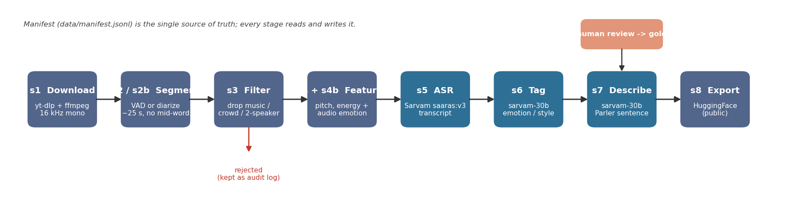
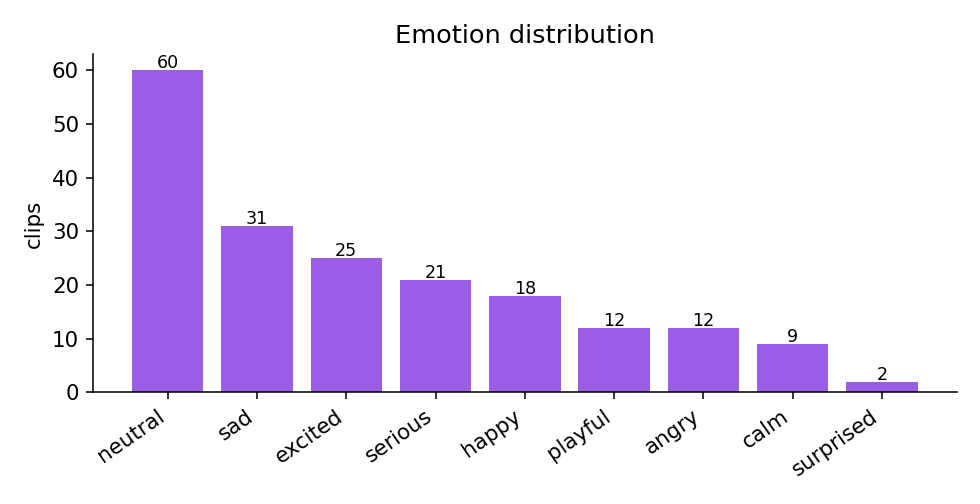
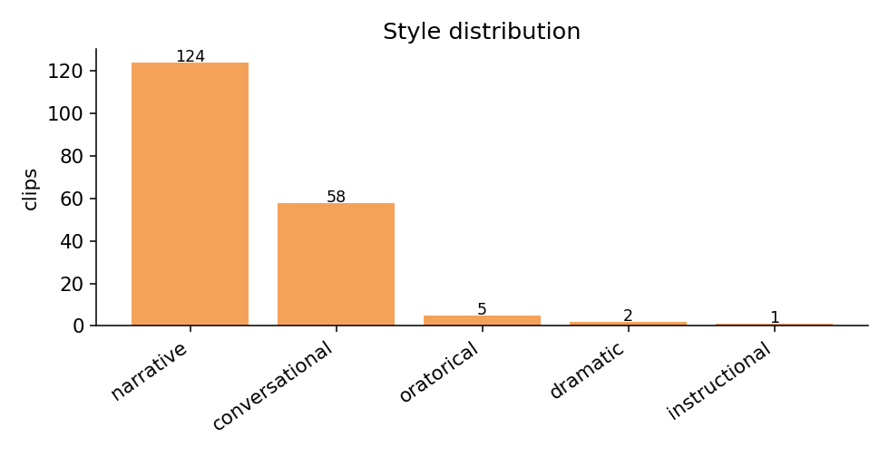
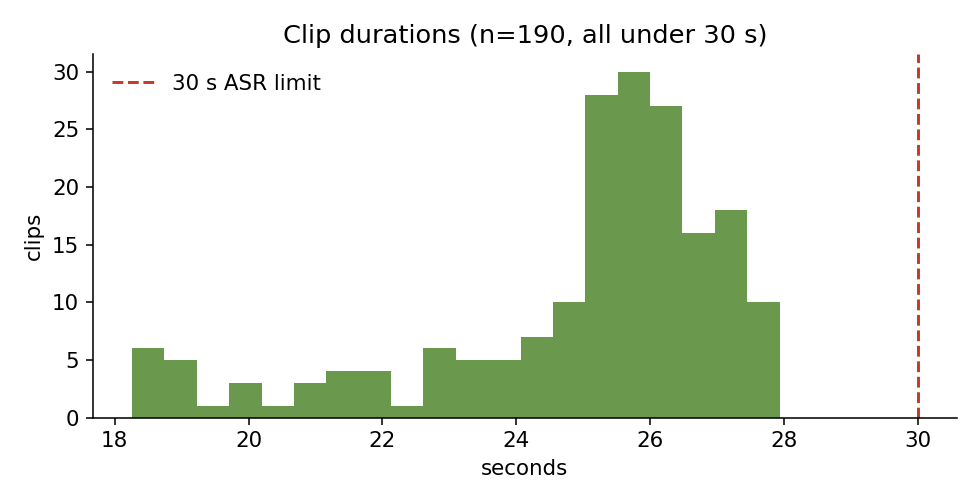

# Sarvam-style TTS Training Dataset (Telugu + Indian English)

A small, **high-curation** single-speaker-per-clip TTS dataset (~80 minutes, 193 clips) of
**Telugu** and **Indian English** speech. Every clip ships an accurate transcript and a
rich, Parler-TTS-style natural-language **style/emotion description**. Built as a take-home
where the emphasis is **data quality and curation judgment**, not pipeline code — *"listen
to the data"* was the core principle.

- **Clips:** 193 (~25s each, always cut at silence so no word is ever clipped)
- **Total audio:** 80.2 min (~40 min Telugu / ~40 min Indian English)
- **Gold (human-verified) subset:** 23 clips (`split="gold"`)
- **Audio:** 16 kHz mono WAV, loudness-normalized
- **Generated:** 2026-06-19

## Pipeline at a glance

A resumable, manifest-driven state machine. `data/manifest.jsonl` is the single source of
truth — one JSON row per clip; every stage reads it, processes its rows, and writes back, so
a crash resumes where it stopped.



## "Listen to the data" — the human review UI

Quality is not assumed; it is checked by ear. A Gradio review tool plays each clip and lets
a human fix the transcript and confirm/correct emotion + style. Verified clips become the
`gold` split and are the basis for the WER/CER numbers. Emotion disagreements between the
text LLM and the audio model are pushed to the **front** of this queue.


## Sources

Each clip records its provenance and a `source_type`. Speaker identity is anonymized to a
stable `spk_*` id per source channel.


| channel | speaker_id | language | source_type | clips | minutes |
| --- | --- | --- | --- | --- | --- |
| BV_Pattabhiram | spk_bv_pattabhiram | Telugu | public_lecture | 23 | 9.9 |
| EN_Audiobook | spk_en_audiobook | Indian English | audiobook | 13 | 5.5 |
| EN_Podcast_Solo | spk_en_podcast_solo | Indian English | podcast_independent | 13 | 5.6 |
| En_Comedy | spk_en_comedy | Indian English | podcast_independent | 13 | 5.1 |
| En_Podcast_Raj | spk_en_podcast_raj | Telugu | podcast_independent | 17 | 6.4 |
| En_Speech | spk_en_speech | Indian English | public_lecture | 16 | 6.8 |
| En_Standup_F1 | spk_en_standup_f1 | Indian English | standup_comedy | 12 | 4.7 |
| En_Standup_F2 | spk_en_standup_f2 | Indian English | standup_comedy | 10 | 4.0 |
| En_Standup_F3 | spk_en_standup_f3 | Indian English | standup_comedy | 10 | 4.1 |
| Garikapati | spk_garikapati | Telugu | public_lecture | 17 | 7.1 |
| Harshaneeyam | spk_harshaneeyam | Telugu | podcast_storytelling | 17 | 7.4 |
| TED_India | spk_ted_india | Indian English | public_lecture | 10 | 4.3 |
| Te_ASMR | spk_te_asmr | Telugu | asmr | 5 | 2.1 |
| Te_Standup_M | spk_te_standup_m | Telugu | standup_comedy | 17 | 7.2 |

## Minutes per language

| language | clips | minutes |
| --- | --- | --- |
| Indian English | 97 | 40.1 |
| Telugu | 96 | 40.2 |
| **TOTAL** | 193 | 80.2 |

## Label distributions

Emotion (`final_emotion = human_emotion or llm_emotion`):



Style (`final_style = human_style or llm_style`):



Clip duration:



### Emotion cross-check (text LLM vs audio model)

The text LLM emotion (`llm_emotion`) and the audio model's emotion (`audio_emotion`) agree
(same valence/arousal quadrant) on **33/193 (17%)** of clips with both opinions.
Disagreements were prioritised for human review, so the `gold` split over-samples the hard
cases. Per-clip dimensional scores ship as `audio_arousal` / `audio_valence` /
`audio_dominance`.

Speaker gender (one speaker per source; reported honestly — see limitations):

| gender | clips | minutes |
| --- | --- | --- |
| male | 97 | 41.6 |
| female | 80 | 31.9 |
| unknown | 16 | 6.8 |

## Methodology

The pipeline is the state machine shown above
(`downloaded -> segmented -> music_checked -> transcribed -> tagged -> described -> final`).

1. **Download & normalize** — audio fetched per channel, resampled to 16 kHz mono and
   loudness-normalized.
2. **Segmentation** — VAD/silence detection (silences >= 300 ms); speech is packed into
   ~18–28 s windows and boundaries land **only inside silences**, so clips never cut
   mid-word. The ~25 s target also keeps every clip under the Saaras v3 30 s synchronous
   limit. A **v2 diarized segmenter** (opt-in per channel) instead uses the Sarvam Batch API
   with diarization to cut at phrase boundaries inside a single speaker's turns — used for
   multi-speaker sources, keeping only the dominant speaker.
3. **Music / crowd-noise / multi-speaker filter (detect & DROP, never repair)** —
   `inaSpeechSegmenter` labels speech/music/noise. A clip is rejected if music overlaps
   >10% (`music_bed`), if applause/laughter/crowd `noise` exceeds 25% (`crowd_noise`), or if
   both male and female speech are present (`multi_speaker`). Source separation degrades
   audio and TTS needs clean recordings, so a repaired clip is worse than none. Rejected
   rows are kept as the iteration log.
4. **Acoustic features** — `pitch_mean`/`pitch_std` (librosa YIN), `energy_rms`,
   `speaking_rate`.
   <br>**4b. Audio emotion (second opinion)** — a speech-emotion model runs straight on the
   waveform and is mapped onto our taxonomy. This captures *how* a line was delivered —
   signal the text LLM in step 6 cannot see. Sarvam has no emotion API, so this only
   **adds** an acoustic cross-check; it never replaces a Sarvam call.
5. **ASR** — `saaras:v3`, `mode="transcribe"`, with the **known** language code per channel
   (not auto-detect) for higher accuracy. Empty transcripts are rejected.
6. **Tagging** — acoustic features are binned into Parler axes; `sarvam-30b` then assigns
   emotion, style, and a whisper flag via a strict JSON-only prompt over the
   transcript + features. The LLM emotion is compared against the step-4b audio vote;
   **disagreements are flagged and pushed to the front of human review**.
7. **Description** — `sarvam-30b` composes ONE natural-language sentence from the structured
   fields.
8. **Human review & export** — a stratified gold sample is verified by a human in the Gradio
   UI shown above; WER/CER are computed on that gold subset; the dataset is exported.

### No-overwrite rule

Machine columns (`asr_*`, `llm_*`) and human columns (`human_*`) are **separate keys** and
never overwrite each other. `final_*` fields are computed **only at export**:
`final_transcript = human_transcript or asr_transcript`,
`final_emotion = human_emotion or llm_emotion`. `human_verified=true` rows form the `gold`
split.

## Why a natural-language `description` (Bulbul V3 rationale)

Sarvam's TTS model **Bulbul V3 has no explicit emotion parameter** — it is LLM-based and
infers prosody from the text/context. So instead of bare one-word labels, every clip carries
a rich Parler-TTS-style sentence (e.g. *"A male speaker narrates a Telugu story in a slow,
sorrowful tone with moderate pitch variation, recorded clearly with almost no background
noise."*). A prosody-inferring model trains best on that descriptive signal, while the
structured columns remain available for filtering/conditioning.

## Columns

`clip_id` (stable per-clip key), `audio` (16 kHz), `text` (=`final_transcript`), `language`,
`emotion` (=`final_emotion`), `style`, `whisper`, `speaking_rate_bin`,
`pitch_bin` (binned **per-gender**), `pitch_variation`, `recording_quality`, `description`,
`speaker_id` (anonymized per source), `gender` (per source), `duration`, `source_url`,
`source_channel`, `source_type`, `human_verified`, `split` (`"gold"` if human-verified else
`"train"`), `audio_emotion`, `audio_arousal` / `audio_valence` / `audio_dominance`.

### Taxonomy

- **emotion:** neutral, happy, sad, angry, excited, calm, fearful, surprised, serious, playful
- **style:** narrative, conversational, oratorical, instructional, devotional, dramatic
- **speaking_rate_bin:** very_slow, slow, measured, fast, very_fast
- **pitch_bin:** low, moderate, high (per-gender)
- **pitch_variation:** monotone, moderate, animated
- **recording_quality:** clean, slight_noise, noisy

## Known limitations

- **Small scale.** A curated seed (~1 hour), not a production corpus.
- **Machine labels are weak supervision.** Emotion/style/description come from `sarvam-30b`
  over acoustic features; only the `gold` split is human-verified. Treat non-gold labels as
  noisy.
- **Two automatic emotion opinions, neither is ground truth.** The text LLM sees only the
  transcript+features; the audio model was trained on English/German affective speech, so
  its absolute calibration on Telugu is approximate. It is a *relative* cross-check to
  surface disagreements, not a label of record.
- **ASR errors remain** in non-gold `text`; CER is higher for Telugu by script nature.
- **Speaker-gender balance is uneven** — most publicly available solo lecture/podcast
  sources for these languages are male. Female sources were added deliberately, but parity
  is not guaranteed.
- **Per-clip single speaker**, but the dataset spans multiple speakers (one per source).

## Ethics & licensing

- Audio is sourced from publicly available recordings; each clip records its `source_type`
  (asmr, audiobook, podcast_independent, podcast_storytelling, public_lecture,
  standup_comedy) and `source_url`.
- We **avoid copyrighted film/music audio** and drop any clip with a detected music bed.
- Licensing posture is stated **honestly**: redistribution rights for the third-party source
  audio are **not individually cleared**, so this dataset is released **`cc-by-nc-4.0` for
  the annotations/curation contributed here**, and is intended for **research and
  educational use only**. Downstream users must independently verify rights for the
  underlying audio before any commercial use.
- `ai4bharat/Mann-ki-Baat` (CC BY 4.0) can serve as a verified-transcript quality anchor.

## Reproduce

```bash
pip install -r requirements.txt
# set SARVAM_KEY and HF_TOKEN in .env, edit config.yaml channels + hf.repo_id
python pipeline/s1_download.py && python pipeline/s2_segment.py
python pipeline/s2b_diarized_segment.py   # only for channels with `diarized: true`
python pipeline/s3_music_filter.py && python pipeline/s4_features.py
python pipeline/s4b_audio_emotion.py      # audio-model second opinion on emotion
python pipeline/s5_asr.py && python pipeline/s6_tag.py && python pipeline/s7_describe.py
python review/gold_sample.py && python review/review_ui.py   # human verification
python eval/compute_wer.py && python eval/distributions.py
python pipeline/s8_export.py
```
