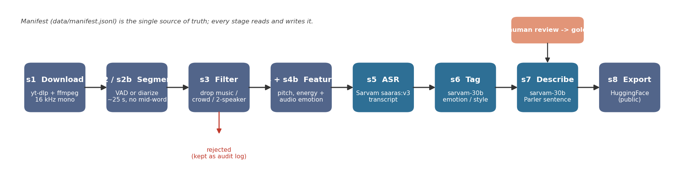
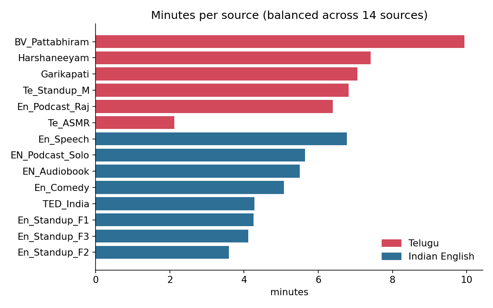

# The short version

I set out to build a 60-minute, single-speaker text-to-speech dataset — roughly half Telugu, half Indian English — where every clip is one person speaking cleanly, with an accurate transcript and a plain-English sentence describing *how* it's said (the speaker's emotion, style, pace, pitch). I collected a lot more than I needed from 14 YouTube sources, ran it through a quality pipeline, listened to the data (my grandmother helped with the Telugu), and trimmed it down to a balanced set.

**Where it landed:** 190 clips, 79 minutes, split evenly (95 Telugu / 95 English). This is a deliberately over-sized "review buffer" — bigger than 60 minutes on purpose, so clips can be thrown out during review and the set still clears the 30-min-per-language bar. The script `pipeline/balance.py` re-trims it to the final size whenever I want.

The assignment says it's graded on *data quality and judgment, not code*, so most of this report is the story: what I built, the things that went wrong, and what I'd fix.

# A quick glossary

A few terms show up throughout. In plain language:

| Term | What it means here |
|---|---|
| **ASR** | Automatic Speech Recognition — turning audio into text. Sarvam's model is `saaras:v3`. |
| **VAD** | Voice Activity Detection — finding where speech is vs. silence, so I can cut clips at pauses. |
| **Diarization** | "Who spoke when" — splitting a recording by speaker, so I can keep just one person. |
| **SER** | Speech Emotion Recognition — a model that guesses emotion from the *sound*, not the words. |
| **Parler-style description** | A natural-language sentence describing delivery (e.g. *"A woman narrates slowly in a calm voice"*), the format the Parler-TTS project popularised. |
| **Code-switching** | Mixing two languages in one sentence — extremely common in Indian speech (Telugu with English words). |
| **WER / CER** | Word / Character Error Rate — how far a transcript is from the correct one (lower is better). |
| **Manifest** | My single bookkeeping file, `data/manifest.jsonl` — one row per clip holding everything known about it. |

# The sources I collected (what the names mean)

The dataset is only as good as what goes in, so I picked sources for *variety* — different speakers, genders, and speaking styles — not just whatever was easy. Each gets a short code-name in the config:

| Source name | What it actually is | Lang | Why I chose it |
|---|---|---|---|
| `Harshaneeyam` | A Telugu literary **storytelling** podcast | te | emotional range (sad, excited) |
| `BV_Pattabhiram` | A Telugu **motivational / counselling** lecture | te | calm, serious delivery |
| `Garikapati` | Garikapati N. Rao's Telugu **literary discourse** | te | oratorical, animated |
| `Te_Standup_M` | A Telugu **stand-up comedy** set (male) | te | playful/happy + a crowd-noise test |
| `Te_ASMR` | Telugu **ASMR** (whispered) | te | the only way to get *whisper* clips |
| `En_Podcast_Raj` | A long **podcast** that turned out to be Telugu (see iteration 6) | te | conversational; added a female Telugu voice |
| `TED_India` | A **TEDx India** talk | en | clear oratorical English |
| `EN_Audiobook` | An Indian-English **audiobook** narration (female) | en | clean narrative reference |
| `EN_Podcast_Solo` | A solo Indian-English **podcast** monologue (male) | en | conversational |
| `En_Comedy` | *"A Moment of Silence"*, a **multi-host comedy podcast** (female-led) | en | playful/happy; diarized to one speaker |
| `En_Speech` | An Indian-English **speech** | en | oratorical |
| `En_Standup_F1/F2/F3` | Three **female stand-up** specials | en | fix a male-heavy roster; happy/excited |

So when I say "`En_Comedy`", that's a real comedy podcast with several hosts talking over each other — which is exactly why it needed diarization to pull out a single voice.

# 1. What I built and how the pipeline works

The whole thing is a chain of small scripts, each doing one job and writing its result back to one file (`data/manifest.jsonl`). Because every clip's progress is recorded in that file, I can stop and restart anywhere — which mattered, because I hit crashes and ran out of API credits more than once, and every restart just picked up where it left off.

{width=100%}

Walking through the stages:

- **Download** (`s1`) — grab each source's audio with `yt-dlp`, convert to 16 kHz mono and even out the loudness with `ffmpeg`.
- **Segment** (`s2`) — cut each recording into ~25-second clips, but *only at silences*, so a word is never chopped in half. Every clip stays under the 30-second limit Sarvam's ASR needs. For sources with more than one speaker, `s2b` instead runs Sarvam's diarization and keeps only the person who talks the most.
- **Filter** (`s3`) — listen for problems and *throw clips out*: background music, crowd noise, or two people in one clip. I never try to "repair" audio — for TTS, a cleaned-up clip is worse than no clip.
- **Features** (`s4`, `s4b`) — measure pitch, energy, and pace; and separately, run a model that guesses emotion straight from the *sound*.
- **Transcribe** (`s5`) — send each clip to Sarvam `saaras:v3`, telling it the language up front for accuracy.
- **Tag & describe** (`s6`, `s7`) — ask Sarvam's `sarvam-30b` for the emotion, style, and whisper flag, then for the one-sentence description.
- **Export** (`s8`) — package it as a HuggingFace dataset and publish.

## The one rule I'm proud of

The machine's guesses and the human's corrections are kept in **separate columns that never overwrite each other**. The transcript Sarvam produced lives in `asr_transcript`; if a human fixes it, that goes in `human_transcript`. They're combined only at the very end:

```python
final_transcript = human_transcript or asr_transcript   # human wins if present
final_emotion    = human_emotion    or llm_emotion
```

This means the raw machine output is never lost, so I can always measure honestly how good the ASR was. Human-checked clips become the trusted **gold** set. A manifest row, grouped by who owns each field:

```
identity : clip_id, source_channel, language, gender, duration, ...
machine  : asr_transcript / llm_emotion / llm_style / whisper / audio_emotion ...
human    : human_transcript / human_emotion / human_verified / reviewer ...
```

# 2. Iterations I did to improve data quality

Almost every quality gain came from catching the pipeline quietly doing the wrong thing. In order:

1. **The music filter wasn't filtering anything.** The library I used (`inaSpeechSegmenter`) crashed on every single clip due to a version mismatch — but the crash was swallowed, so the stage "succeeded" while detecting zero music. I had to pin an older Keras and patch a NumPy call. *Lesson: a stage that fails silently is more dangerous than one that crashes loudly.*

2. **70 good clips were wrongly thrown out as "two speakers."** The gender detector was labelling chunks of one expressive male storyteller as "female" (his pitch swings fooled it), which tripped the two-speaker check. I added a per-source `solo: true` flag meaning "I listened, it's one person — skip that check."

3. **The LLM returned blank answers and burned through credits.** `sarvam-30b` is a *reasoning* model: left alone it spent its entire token budget "thinking" and returned nothing. Every call was both expensive and useless. The fix was one setting (`reasoning_effort=None`) that turns thinking off — about 60x cheaper and 30x faster.

4. **A whole source was silently skipped** because its YouTube id had an underscore in it, which broke my filename parsing. Fixed by matching against the known source names.

5. **Clips started too abruptly.** I was cutting flush to the first sound, which clipped the start of words. Added a small 120 ms cushion taken from the surrounding silence. For ASMR I also had to stop long silent gaps from being packed into clips.

6. **A source I labelled "English" was actually Telugu.** `En_Podcast_Raj` is Telugu with heavy English mixing, but I'd set it to English — so Sarvam faithfully wrote the Telugu in Latin letters (*"O pakka divorce teesukunna vaadu..."*). It *sounded* Telugu but *read* English. Only listening caught it. Relabelling it Telugu and re-running gave proper Telugu script, and I noticed the main speaker is female — which helped balance the dataset.

7. **Whisper can't be detected from text.** The LLM only sees the words, so it can't know a clip is whispered. For ASMR sources I just tell it directly with a `whisper: true` flag.

8. **Over-collect, then balance.** I gathered 617 clips, then wrote `balance.py` to trim down to an even spread across every source and both languages, always keeping any clip a human had already checked.

# 3. What worked and what didn't

**Worked**

- Cutting only at silences: all 190 clips land between 18 and 28 seconds, none over the limit, no chopped words.
- Sarvam's ASR is strong on clean audio — on the clips a human checked, the transcripts were good enough to accept as-is. It also handles Telugu-English mixing and writes the English in Telugu script.
- Diarization cleanly pulled single speakers out of 3-4-person podcasts.
- The crowd-noise filter removed 79 noisy stand-up clips.
- The diversity push worked: I went from an almost entirely "narrative + neutral" set to one with real conversational and playful clips, and from 90% male to ~40% female.

**Didn't**

- **Some crowd noise still slips through.** My noise check is a blunt "is more than 25% of the clip noisy?" rule, and the detector can't tell "clean voice" from "voice with light laughter underneath", so a few stand-up clips kept faint audience noise. This is the dataset's weakest spot.
- **English ASMR produced zero clips** — it's whispered so quietly that my silence detector treated the whole thing as silence.
- The audio-emotion model and the text-LLM only agree ~15% of the time on Telugu, because that model was trained on English/German. I use it only to *flag* clips for human attention, never as a label.
- The set still leans narrative — long-form Indian content is mostly monologue.

# 4. Quality observations and decisions I made

The final set, by the numbers:

| | |
|---|---|
| Language | Telugu 39.7 min (95 clips) · English 39.2 min (95) |
| Gender | male 41 min · female 31 min (~40%) · unknown 7 |
| Whisper clips | 5 |
| Collected -> kept | 617 -> 190 (dropped: 60 music, 79 crowd, 13 by hand, 275 to balance) |

{width=80%}

{width=66%}

{width=66%}

**On accuracy (WER/CER).** Measured on the 37 human-checked clips, error rate is 0.00 — but I want to be honest about what that means: the reviewers *accepted Sarvam's transcripts unchanged*, so this is really an "approval rate" on clean clips, not a strict error rate against a from-scratch transcription. It's a genuinely good sign for Sarvam on clean audio, but a stricter test (re-transcribing blind) would give a truer number.

**Decisions worth calling out:**

- **Two opinions on emotion.** The text LLM reads the words; a separate model listens to the sound. When they disagree (they did on 161 of 190 clips), that clip goes to the front of the human-review queue — that's where a human's time is worth the most.
- **Listening is the real work, so I made it easy.** I built a review app a non-technical person could use, and my Telugu-reading grandmother checked the Telugu clips — better ground truth than me, since I don't read Telugu. She listened, confirmed or fixed the text, tapped an emoji for the feeling, and saved (or rejected bad clips). 37 verified, 13 rejected.

{width=80%}

{width=80%}

# 5. What I'd improve given more time

**First, how I worked.** My biggest mistake was process, not code: once the first small test worked, I built the whole pipeline in one go and leaned heavily on AI agents to write it — so the silent bugs above only surfaced when I ran everything together. Next time I'd test each stage on two or three clips and check its output myself before moving to the next, and treat the AI as a pair-programmer I review rather than letting it drive.

**Then, the data:**

- **Better noise detection** (the top fix). Instead of one blunt threshold, measure each clip's signal-to-noise ratio, add a model that specifically detects applause/laughter/crowd, gently denoise only the borderline clips, and send more of them to a human ear.
- **Shorter clips** (say 8-12 seconds). Smaller windows span fewer speaker turns, so there's far less chance of two voices landing in one clip — the main risk with podcasts.
- **Per-source silence settings** so quiet ASMR segments properly (this would recover the English ASMR I lost).
- **A multilingual emotion model** that actually knows Indian languages, so the audio and text emotion opinions agree more often.
- **More female Telugu sources, more genres, and a YouTube scraper** to scale past a hand-picked roster — plus a fuller human-review pass for a larger trusted set.

# Ethics and licensing

Every clip records where it came from and what kind of source it is. I avoided copyrighted film and music, and dropped anything with a music bed. I haven't individually cleared redistribution rights for the underlying audio, so the dataset is meant for **research and educational use**; the licence tag covers the annotations I added. Anyone using it commercially should clear the source audio themselves.
