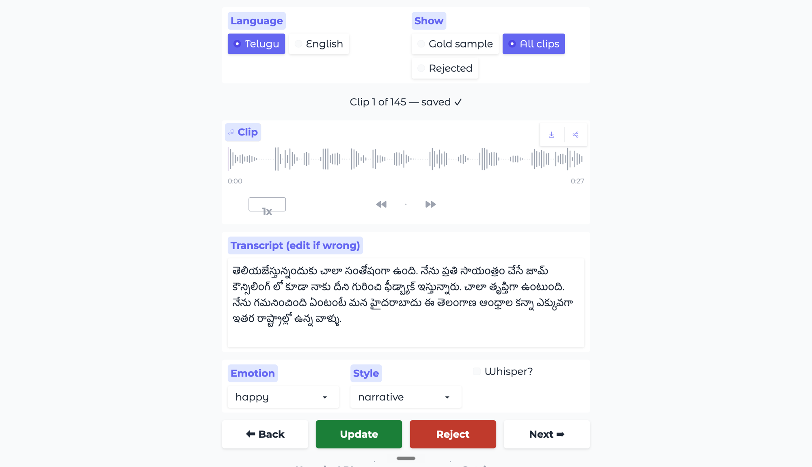
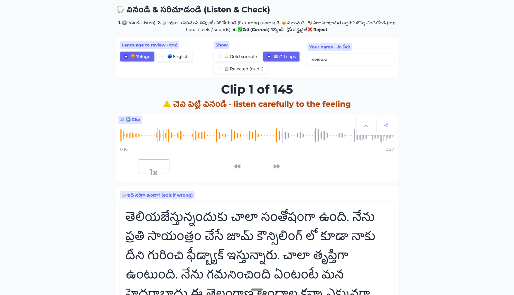

# A Single-Speaker TTS Dataset for Telugu + Indian English

**190 clips / 79 minutes, balanced 95 Telugu + 95 Indian English, across 14 sources** — each clip a single speaker, with an accurate transcript and a Parler-TTS-style natural-language style/emotion description, published on HuggingFace.

> The current export is an **over-collected ~80-min review buffer** (~40 min per language), deliberately larger than the 60-min target so clips can be rejected during the human pass and still clear the >=30 min/language bar. `pipeline/balance.py <minutes>` re-culls to the final size after review.

The brief is graded on **data quality and curation judgment, not code**, so this report is mostly the *story*: what I built, every place the pipeline quietly did the wrong thing, what I did about it, and what I'd do next.

---

## 0. Where it started: a one-clip spike

Before any pipeline, I wrote a throwaway end-to-end script on a *single* YouTube link to de-risk the Sarvam APIs and the data shape:

> `yt-dlp` -> `raw.wav`    `ffmpeg` -> 16 kHz mono (`norm.wav`)    cut a **fixed 30 s segment from 0:60** (`clip_000.wav`)    `librosa` features    `saaras:v3` transcript    `sarvam-30b` -> emotion / style / confidence / reasoning    one `manifest.jsonl` row.

It answered three questions cheaply: *can I get clean 16 kHz audio from YouTube, does Saaras handle a ~25 s Telugu/Indian-English clip, and can the LLM return structured tags?* All yes. Crucially, that **fixed-time 30 s cut** is exactly the naive approach the production pipeline had to replace — it chops mid-word and ignores who's speaking. Everything after the spike was **curation**: silence-aware cutting, music/crowd rejection, diarization, the human/machine split, and balancing. Those gates are the actual work.

---

## 1. The pipeline: a manifest-driven state machine

`data/manifest.jsonl` is the **single source of truth** — one JSON row per clip. Every stage loads it, filters rows by a `stage` field, processes them, and writes back. Each row walks a state machine:

```
downloaded -> segmented -> music_checked -> transcribed -> tagged -> described -> final
                                                       (or  rejected + rejected_reason)
```

Because progress lives in the manifest, the whole pipeline is **crash- and credit-safe**: re-running any stage skips rows already past it. (This saved me repeatedly — I hit dependency crashes and ran out of API credits mid-run, and every restart resumed exactly where it stopped.)

### Stage by stage

- **`s1_download`** — `yt-dlp` pulls each source's audio; `ffmpeg` normalizes to **16 kHz mono, -23 LUFS**. A download archive means re-runs only fetch new URLs.
- **`s2_segment`** — VAD via `pydub.silence`. It cuts **only at silences >= 300 ms** and greedily packs speech into **18-28 s** windows, so a boundary can never fall mid-word, and every clip stays under the **30 s `saaras:v3` synchronous limit**. Adds a small `clip_pad_ms` lead-in/out and breaks on `clip_max_gap_ms` of internal silence (see iterations).
- **`s2b_diarized_segment`** *(opt-in per source)* — for genuine multi-speaker audio (interviews, multi-host podcasts) it runs the **Sarvam Batch STT API with diarization**, keeps only the **dominant speaker's** phrase chunks, and packs those. Single-speaker by construction.
- **`s3_music_filter`** — `inaSpeechSegmenter` labels speech / music / noise per frame. **Detect-and-drop, never repair:** music bed > 10% -> reject `music_bed`; crowd noise > 25% -> reject `crowd_noise`; both-genders present -> reject `multi_speaker` (with a `solo:` opt-out, see iterations). Survivors carry a `recording_quality` downgrade.
- **`s4_features`** — `librosa` pitch (YIN), energy, speaking rate -> binned into the Parler axes.
- **`s4b_audio_emotion`** — a wav2vec2 speech-emotion model on the **raw waveform**: a *second*, audio-grounded emotion opinion (the signal the text LLM can't see).
- **`s5_asr`** — **Sarvam `saaras:v3`**, `mode=transcribe`, with the **known** language code (`te-IN`/`en-IN`) for accuracy.
- **`s6_tag`** — **Sarvam `sarvam-30b`** assigns `emotion` / `style` / `whisper` from transcript + features, then cross-checks against the s4b audio vote.
- **`s7_describe`** — **`sarvam-30b`** composes the one-sentence Parler description.
- **`s8_export`** — builds the HuggingFace `datasets` object (16 kHz `Audio`), shuffles, writes the dataset card, pushes public.

**Sarvam everywhere it's mandated:** ASR (`saaras:v3`), diarization (Batch STT), and all LLM tagging/description (`sarvam-30b`). The non-Sarvam pieces (VAD, music filter, acoustic features, audio-emotion) only exist where Sarvam has no endpoint.

### The schema (and the one rule that matters)

Each manifest row groups its fields by *who owns them*. **Machine columns and human columns are separate keys that never overwrite each other** — the single most important design decision in the project:

```
identity   : clip_id, source_url, source_channel, source_type, language, gender,
             start_time, end_time, duration
quality(s3): has_music, music_confidence, has_noise, noise_confidence,
             has_multi_speaker, gender_detected
acoustic   : pitch_mean, pitch_std, energy_rms, speaking_rate  (+ *_bin derived axes)
asr   (s5) : asr_transcript, asr_model, asr_language_detected, asr_confidence
llm   (s6) : llm_emotion, llm_style, whisper, llm_confidence, llm_reasoning, annotated_at
audio (s4b): audio_emotion, audio_emotion_score, emotion_agree
human (UI) : human_transcript, human_emotion, human_style, human_whisper,
             human_verified, reviewer, reviewed_at
```

A reviewer can only write `human_*`. The `final_*` fields are computed **only at export**:

```python
final_transcript = human_transcript or asr_transcript
final_emotion    = human_emotion    or llm_emotion
```

So the raw machine output always survives for honest WER measurement, and `human_verified` rows become the **`gold`** split. The published columns are `clip_id, audio, text, language, emotion, style, whisper, speaking_rate_bin, pitch_bin, pitch_variation, recording_quality, description, speaker_id, gender, duration, source_url, source_channel, source_type, human_verified, split` (+ the `audio_*` second opinion).

---

## 2. "Listen to the data": the human-review loop

The brief says listening to the data is the core of the grade, so I built a **bilingual Gradio review UI** designed for a *non-technical* reviewer — specifically so my **Telugu-reading grandmother could verify the Telugu transcripts**, which is far better ground truth than me (I don't read Telugu).

Everything about it is built for her: a one-click **Telugu / English** language toggle (she sees only Telugu clips), **very large** transcript text, **emoji** emotion/style buttons so feeling is judged *by ear, not by reading an English word*, autoplaying audio, a progress tracker (done / left), an online-test-style "jump to any clip" palette, and big **Save / Reject** buttons. Her job per clip: listen, confirm or fix the transcript, tap how it sounds, Save — or Reject a bad clip. Her name is stamped into `reviewer`.

{width=82%}

{width=82%}

This pass verified **37 clips** (20 English by me, 17 Telugu by my grandmother) and **rejected 13** bad clips by ear. Review time is steered to where it's worth most: s4b's audio-emotion vote is compared with s6's text-emotion vote in valence/arousal space, and the **161/190 disagreements** are pushed to the front of the queue.

---

## 3. Iterations that improved quality (the war stories)

Most quality came from catching the pipeline *silently* doing the wrong thing.

1. **The music filter detected nothing — and "succeeded."** `inaSpeechSegmenter`'s bundled `pyannote.algorithms` calls `np.vstack(<generator>)` (rejected by NumPy >= 1.24); once shimmed, its Keras-2 CNNs crash under Keras 3 (TF >= 2.16). The first run errored on **all 235 clips, kept 0, flagged no music** — while reporting success. Fixed with a repo-local viterbi shim + `TF_USE_LEGACY_KERAS=1`. *Lesson: a stage that fails silently is worse than one that crashes.*

2. **70 good clips wrongly rejected as "multi-speaker."** Measuring the splits showed the gender CNN labeling **39-51% of one expressive male storyteller's speech as "female"** (pitch swings fool a binary classifier). Added a per-channel `solo: true` opt-out ("I listened, it's one speaker") that skips the noisy guard; recovered the clips.

3. **`sarvam-30b` returned empty answers *and* burned credits.** It's a reasoning model: with no `max_tokens` it spent the entire 4096-token starter-tier budget on hidden chain-of-thought and returned `content=None` — maximally expensive, zero output. The fix (from Sarvam's docs) is `reasoning_effort=None` — an explicit JSON null, *not* the string `"none"` (which 400s) — giving direct JSON in ~70 tokens / ~0.5 s: **~60x cheaper, ~30x faster.**

4. **A YouTube id with an underscore skipped a whole source.** Filename parsing used `rpartition("_")`, but ids like `DV1zxu47_mA` broke it -> a podcast silently dropped. Fixed with known-channel-name matching.

5. **Clips cut flush to the first sample** risked clipped onsets -> added `clip_pad_ms` (120 ms lead-in/out from surrounding silence).

6. **ASMR edge cases.** Long internal pauses got packed into clips -> `clip_max_gap_ms`. The LLM can't *hear* whisper from text -> per-channel `whisper: true` override. And **English ASMR segmented to 0 clips** because it's whispered *below* the -38 dB silence threshold (VAD reads it as silence) — a real limitation (§5).

7. **A whole "English" source was actually Telugu — caught only by listening.** `En_Podcast_Raj` was configured `en-IN`, so Saaras faithfully **romanized** the Telugu into Latin script ("*O pakka divorce teesukunna vaadu judge chesestoo...*"): it *played* Telugu but *read* English. Relabeling it `te-IN` and re-running ASR -> tag -> describe gave proper Telugu script; listening also revealed the dominant speaker is **female** (configured `male`), which re-binned pitch and rewrote descriptions. Net: the source moved to the Telugu column and pushed the dataset's **female share to ~40%**.

8. **Over-collect, then balance.** Collected **617 clips**, then `balance.py` culls to a balanced target — round-robin across each language's sources (so the tiny 2-min ASMR channel doesn't strand budget), always keeping reviewed clips, marking the rest as recoverable `balance_trim`.

9. **Ran out of credits twice** (the reasoning bug, then scale). Resumability meant each top-up continued with zero rework.

---

## 4. What worked & what didn't

**Worked**

- **Silence-based segmentation:** every clip lands on a silence; **0 of 190 clips exceed the 30 s limit** (18.3-28.2 s); no mid-word cuts.
- **`saaras:v3` + code-switching:** it transliterates code-switched English into Telugu script (almost no Telugu clip contains Latin text). On the human-checked gold clips the transcripts were accepted essentially verbatim.
- **Diarization** extracted clean single-speaker clips from 3-4-person podcasts.
- **Crowd-noise filter** dropped **79 standup clips** drowned in applause while keeping the clean ones.
- **The diversity push moved the needle:** style narrative 124 / **conversational 58**; emotion now spans 9 classes; **female up to 31 min (40%)**; 5 whisper clips.

**Didn't (honest)**

- **Crowd noise still leaks through on some kept standup clips.** Adding standups was right for emotion diversity (they supply most `happy`/`playful`/`excited` clips), but the s3 gate is a coarse "noise fraction > 25%" rule, and a 3-class segmenter can't separate "clean voice" from "voice + light applause" — so sub-threshold audience noise survives. Human review catches the worst; this is the dataset's weakest spot (fix in §5).
- **English ASMR -> 0 clips** (whisper below the silence floor).
- **Text-vs-audio emotion agreement is only ~15% (29/190).** The audio SER model is English/German-trained, so it's approximate on Telugu — used *only* as a relative cross-check to route human attention, never as a label.
- **Style still narrative-leaning** (124/190): long-form Indian content skews monologue.

---

## 5. Quality observations & decisions

**Final composition (190 clips / 79.0 min):**

| Axis | Distribution |
|---|---|
| Language | Telugu 39.7 min (95) · Indian English 39.2 min (95) |
| Gender | male 41.1 min · **female 31.1 min (40%)** · unknown 6.8 |
| Style | narrative 124 · conversational 58 · oratorical 5 · dramatic 2 · instructional 1 |
| Emotion | neutral 60 · sad 31 · excited 25 · serious 21 · happy 18 · playful 12 · angry 12 · calm 9 · surprised 2 |
| `source_type` | public_lecture 66 · standup_comedy 46 · podcast_independent 43 · podcast_storytelling 17 · audiobook 13 · asmr 5 |
| Whisper | 5 |

**Curation funnel:** `617 collected -> 60 music_bed + 79 crowd_noise + 13 manual + 275 balance_trim dropped -> 190 kept`. Rejected rows stay in the manifest as the audit trail.

**WER / CER** (`eval/compute_wer.py`, on the 37 gold rows): **0.00 / 0.00** for both languages. **Honest caveat:** this is because the reviewers accepted the `saaras:v3` transcripts **verbatim** (`human_transcript == asr_transcript`), so it's an *ASR-approval rate on clean clips*, not an error rate against blind re-transcription. It's a real positive signal for Saaras on clean audio, but a stricter protocol would give a truer number.

**Decisions worth calling out:** two independent emotion opinions (text + waveform) with disagreements routed to humans; detect-and-drop over source separation; per-gender pitch binning with a detected-gender fallback; rich descriptions over bare labels (Bulbul V3 has no emotion parameter — it infers prosody from text); and treating only `gold` as fully trusted (everything else is weak supervision).

---

## 6. What I'd improve given more time

**Process (the honest one first): verify each stage before chaining it, and don't outsource the thinking.** My biggest mistake was *how* I built it: once the one-clip spike worked, I implemented `s1`–`s8` in one sweep and only discovered the **silent** failures — the music filter detecting nothing, `sarvam-30b` returning empty `content` — when I ran the whole chain end-to-end, instead of validating each stage on a few clips first. Leaning heavily on AI agents for the implementation made it easy to accept plausible-looking code without checking each component's output myself, so bugs hid behind stages that "succeeded." Next time I'd (a) write a tiny smoke test per stage — run it on 2-3 clips and assert the exact manifest fields it should produce before moving on — and (b) treat the AI as a pair-programmer whose output I review stage-by-stage, not as the driver. Most of the war-stories in §3 would have been caught in minutes instead of mid-run.

Technical improvements:

- **Better noise detection & removal** (top priority — the crowd-noise leak). Replace the single coarse threshold with: (a) **per-clip SNR** from the silence regions, rejecting on SNR not just noise-fraction; (b) a **learned audio-event tagger** (YAMNet/PANNs for applause/laughter/crowd/music) as a finer second opinion that rejects on *any* strong non-speech event over the voice; (c) **targeted denoising** (RNNoise / DeepFilterNet) on borderline clips only, with a before/after check so it never touches clean audio; (d) a lower review threshold so more borderline clips reach the human ear.
- **Smaller clips to reduce 2-speaker overlap.** Shorter windows (~8-12 s vs ~25 s) span fewer speaker turns, so the odds of two voices (or a guest interjection) in one clip drop sharply — important for podcasts/interviews. Trade-off: more clips and ASR calls. I'd pair it with a per-clip diarization-confidence check that drops any clip with second-speaker energy.
- **Better audio processing overall:** per-channel VAD thresholds (a lower `silence_thresh_db` recovers the English ASMR), consistent high-pass/de-essing, and forced alignment for tight word-level onset trimming.
- **Stronger emotion labels:** a multilingual SER model (`MERaLiON-SER-v1`, covers Tamil + emits VAD dims) to lift the ~15% audio/text agreement on Telugu.
- **More balance & scale:** more *female Telugu* sources, more genres (debate, devotional, news) to break the narrative lean, a YouTube scraper to scale past the hand-picked roster, and a fuller human-review pass for a larger gold set + real WER.

---

## Ethics & licensing
Every clip records its `source_type`. I avoid copyrighted film/music audio and drop any clip with a detected music bed. Redistribution rights for third-party source audio aren't individually cleared, so the dataset is for **research/educational use**; the `cc-by-4.0` tag covers the annotations contributed here. Downstream users must verify rights for the underlying audio.
